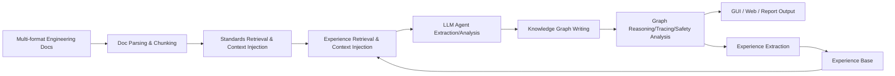

# AeroKG

> **AeroKG** is an offline intelligent system for civil aviation airworthiness and highly reliable industrial knowledge domains.  
> It combines **industrial ontology, knowledge graph, RAG, LLM Agent, airworthiness standards library, experience loop**, and **domestic inference deployment**. The goal is not to "make a chatbot", but to build an **engineering knowledge platform that is traceable, auditable, and sustainably evolving**.

<p align="left">
  
  
  
  
  
  
  
</p>

---

## Table of Contents

- [Project Positioning](#project-positioning)
- [Why This Project Matters](#why-this-project-matters)
- [What's Truly "New" About This Project](#whats-truly-new-about-this-project)
- [System Architecture](#system-architecture)
- [Core Capabilities](#core-capabilities)
- [Industrial Pain Points Addressed](#industrial-pain-points-addressed)
- [Technical Workflow](#technical-workflow)
- [Project Structure](#project-structure)
- [Quick Start](#quick-start)
- [Typical Use Cases](#typical-use-cases)
- [Current Progress & Next Priorities](#current-progress--next-priorities)
- [Safety Statement](#safety-statement)

---

## Project Positioning

AeroKG targets scenarios such as **civil aviation airworthiness certification, system safety evaluation, requirements traceability, change impact analysis, maintenance, and knowledge governance**—all demanding high reliability.

It is designed not just for single-turn Q&A, but to handle a complete chain of engineering problems, such as:

- Document sources are numerous and messy in structure
- FMEA / Fault Trees / Maintenance / Requirements & Validation docs have mismatched naming/structure
- Knowledge annotation is unstable: entity boundaries, hierarchies, and relation types are often muddled
- Relationship extraction is not always imprecise; often, **the underlying knowledge system itself is still evolving**
- Even with RAG and knowledge bases, knowledge tracing and auditability are not "solved"
- For aerospace, medical, or other high-stakes domains, it's not just about "being able to answer", but **controlling hallucinations, tracing evidence, and being auditable**
- Real-world deployment must also address **domestic hardware, inference frameworks, operator adaptation, throughput, and latency**

So the goal of AeroKG is:

> Transitioning from “documents + models” to an **industrial knowledge system managed by ontology constraints, standards injection, graph reasoning, feedback loops, and tightly coordinated hardware/software deployments**.

---

## Why This Project Matters

In high-safety industries, general RAG or chatbots just aren't enough.

Key insights of AeroKG:

1. **Software and application layers aren't the main challenge**: GUI, document parsing, standards retrieval, Agent orchestration—all are increasingly engineerable.
2. **The real challenge is at the knowledge layer**: Chaotic document hierarchy, inconsistent annotation, continual knowledge evolution—these determine the upper bound of extraction, retrieval, reasoning, and audit.
3. **Trustworthiness is critical**: In aerospace, medical, or similar fields, the system output must answer “why,” with clear sources and explicit separation between inference and known facts.
4. **Real-world deployment needs hardware-software co-optimization**: To run on domestic ecosystems, we must consider model choice, inference stack, operator mapping, throughput, and stability.

So, AeroKG is about:

- Not just knowledge extraction
- Not just RAG
- Not just a knowledge graph viewer
- But a **trustworthy knowledge infrastructure for highly reliable engineering systems**

---

## What's Truly “New” About This Project

Below are major innovations that differentiate AeroKG from ordinary KGs, RAGs, or chatbot systems.

### 1. Three-level Industrial Ontology for Airworthiness

AeroKG doesn’t simply convert docs to loose triples, but leverages:

- **BFO Top-level Ontology**
- **IOF Core Industrial Ontology**
- **Aviation-Airworthiness Domain Layer**

Within this framework:

- **74 entity types**
- **36 relation types**
- Covers requirements hierarchy, safety assessment, MBSE architecture, V&V, change management etc.

This is not a generic “knowledge graph system,” but a **domain-semantics-constrained industrial KG system**.

### 2. Seven-level Relationship Strength Spectrum

AeroKG introduces a highly distinct mechanism:

> Uses a **seven-color spectrum (Red, Orange, Yellow, Green, Cyan, Blue, Purple)** to represent knowledge relationship strength.

This is more than a UI effect—it is fundamental to:

- Annotation of relationship strength during extraction
- Graph edge weight representation
- Graph visual explanations
- Critical path and weak link identification

Compared to binary “related/unrelated” KGs, this is more suited for engineering judgment.

### 3. Multi-role LLM Agents, Not Just Chatbots

Six professional agent types are built-in:

- General Knowledge Extractor
- Ontology Reasoner
- Safety Evaluator
- V-Model Tracer
- Change Impact Analyzer
- Document Collator

Each is tuned for specific engineering tasks, not merely a prompt template swap. This allows:

- Cutting “general QA” into “constrained tasks”
- Shifting high-risk analysis from free generation to **taskized, structured, auditable work**

### 4. Proactive, Not Passive, Tripartite Standards Injection

**CAAC / FAA / EASA** standards are included with support for cross-reference.

Rather than waiting for users to search for standards, systems will:

- Auto-retrieve relevant standards by document keywords
- Inject key standard abstracts into agent context
- Let extraction, analysis, and tracing stay airworthiness-aligned

This turns the system from “knows some standards” into “**actively constrained by standards during analysis**”.

### 5. Experience Feedback Loop: Analyze → Extract → Accumulate → Inject

Much valuable expert knowledge in industrial systems isn’t in standards, but in engineering experience.

AeroKG’s experience engine is not a simple log but a full loop:

1. Automatically extracts experience after analysis
2. Organizes experience by project/model/permanent/temporary type
3. Generates bi-lingual Markdown experience entries
4. Supports manual review
5. Automatically injects into future analysis

Thus, the system doesn't just “use” knowledge—it **continuously grows knowledge through use**.

### 6. Governance Mindset for Knowledge Evolution

A core recognition here:

> Industrial knowledge is not static; KGs aren’t one-off assets.

So AeroKG puts special emphasis on:

- Structural governance when doc hierarchies conflict
- Knowledge alignment as annotation schemas drift
- Source knowledge issues behind extraction errors
- Ongoing KB refactoring, validation, evolution

This is much closer to real industrial scenarios than “just building a retrieval-augmented Q&A”.

### 7. Reasoning Deployment for Domestic Ecosystem

AeroKG considers not just model output, but deployment practicality:

- Local **Ollama** inference
- **FastAPI** service endpoints
- **PyQt5** desktop GUI
- **vLLM-Ascend + Huawei Ascend 910B** deployment option

The core issue isn’t “can it run”, but:

- How to match models and hardware operators
- How to ensure robust inference in the domestic ecosystem
- How to maximize throughput/response in offline settings

---

## System Architecture

AeroKG uses a four-layer architecture:

```text
Layer 1  Presentation
  ├─ PyQt5 MainWindow
  ├─ GraphVisualizer
  ├─ LLMWorker
  └─ DocAnalyzeWorker

Layer 2  Business Logic
  ├─ AgentEngine
  ├─ DocParser
  └─ Archiver

Layer 3  Knowledge
  ├─ OntologyEngine
  ├─ ExperienceEngine
  └─ StandardsLibrary

Layer 4  Infrastructure
  ├─ OllamaClient
  ├─ vLLMAscendClient
  └─ File I/O / Config / Persistence
```

### Architectural Principles

- **Presentation Layer**: Handles GUI, interaction, graph visualization
- **Business Logic Layer**: Handles doc parsing, agent workflow, task execution
- **Knowledge Layer**: Handles ontologies, standards, experience, and graph storage
- **Infrastructure Layer**: Handles inference backend, filesystem, config, deployment

### Main Data & Inference Flow



---

## Core Capabilities

### 1. Multi-format Document Ingestion

Desktop and service-side file ingestion supported (config covers):

- PDF
- DOC / DOCX
- XLS / XLSX / CSV
- PPTX
- TXT / MD / RST / TEX
- HTML / XML / JSON / YAML

### 2. Knowledge Extraction & Graph Construction

- Text chunking
- Structured extraction
- RDF / JSON graph storage
- GraphML export
- Visualized HTML graph output

### 3. Enhanced Retrieval & Extensible RAG

Out-of-the-box:

- BM25 retrieval
- Dense retrieval
- Hybrid retrieval
- Reranker
- Query routing/rewrite switch
- Agentic retrieval reserved

### 4. Standard Library & Cross-Reference

Includes:

- FAA standards
- EASA standards
- CAAC standards
- Cross-reference mapping
- standards_db.json unified index

### 5. Experience Engine

- Permanent/temporary experience hierarchy
- Project/model-level directories
- Bilingual experience docs
- Audit summary
- Auto-inject for later analyses

### 6. Dual Interaction Modes

Both:

- **PyQt5 Desktop Application**
- **FastAPI + Web UI Service Endpoints**

This enables both local tool use and gradual evolution to service-oriented systems.

### 7. Evaluation & Engineering Support

Out-of-the-box:

- Benchmark queries
- Eval runner
- Phase-based reports
- CI scripts
- Rollback scripts
- System/security/migration audit planning

---

## Industrial Pain Points Addressed

AeroKG isn’t about abstract “enterprise knowledge management,” but targets real problems, such as:

### Document Hierarchy Chaos

In civil aircraft, complex or medical equipment engineering, common docs are:

- FMEA
- Fault Trees
- Maintenance docs
- Safety assessment docs
- Requirements/Validation docs
- MBSE architecture docs

These come from different teams, phases, tools—resulting in mismatched hierarchy and granularity.

### Knowledge Annotation Misalignment

Common issues:

- The same entity is named differently in different docs
- The same phenomenon is described differently in FTs, manuals, and experience records
- Annotation standards drift
- Crossed hierarchical concepts
- Unstable relation definitions

### Extraction Inaccuracy is Only the Symptom

Often, so-called “extraction errors” are not model issues, but:

- Source knowledge itself is messy
- Relation definitions lack consensus
- Docs are not fully aligned
- The KB itself is still evolving

### Hallucination & Inference in High-risk Scenarios

For aerospace, medical, etc., the system must clearly distinguish:

- Facts supported by standards
- Relationships grounded in KGs
- Model-inferred candidate relations
- Potential conclusions yet to be verified

That’s why AeroKG emphasizes:

- Ontology constraints
- Standards injection
- Relationship strength stratification
- Experience audit
- Human-in-the-loop

### Domestic Ecosystem Inference & Throughput

Upon entering real deployments, challenges shift from “acceptable quality” to:

- Can the model run stably on domestic NPUs?
- Can inference, GUI, and API coordinate?
- How to balance operator/context, throughput, latency?
- How to ensure offline reliability & availability

---

## Technical Workflow

### 1. Document Ingestion

- Manual import or folder monitoring
- Auto-archived to doc directory
- Parsed into plain text/intermediate structure

### 2. Chunking & Indexing

- Splitting documents into chunks
- Chunk metadata organization
- Wiki stub generation
- Retrieval index building

### 3. Standards & Experience Injection

- Match standard clauses by keywords
- Load historical experience by project/model
- Merge for context composition

### 4. Agent Task Execution

- Structured knowledge extraction
- Safety evaluation
- Traceability integrity check
- Change impact analysis
- Ontology reasoning

### 5. Graph Writing & Visualization

- Write entities/relations to the KG
- Assign relationship strength
- GraphML/HTML output
- GUI for interactive visualization

### 6. Experience Feedback

- Auto-extract experience entries
- Manual review
- Permanent/temporary archiving
- Next-round analysis injection

---

## Project Structure

High-level directory overview:

```text
AeroKG/
├─ main.py                     # Desktop app entry
├─ config.yaml                 # System config
├─ requirements.txt            # Python dependencies
├─ deploy_ascend.sh            # Ascend 910B inference deployment script
├─ gui/                        # PyQt5 GUI
├─ core/                       # Core engines (ontology, Agent, standards, experience, parsing, etc.)
├─ src/
│  ├─ backend/                 # FastAPI services
│  ├─ retrieval/               # BM25 / Dense / Hybrid / Rerank
│  ├─ generation/              # Generation modules
│  └─ agentic/                 # Reserved agentic retrieval
├─ knowledge/
│  ├─ chunks/                  # Document chunking
│  ├─ graph/                   # GraphML / schema / builder
│  └─ wiki/                    # Wiki-style knowledge pages
├─ standards/                  # FAA / EASA / CAAC standards
├─ experience/                 # Experience feedback directory
├─ docs/                       # Demo docs
├─ eval/                       # Benchmark & eval scripts
├─ tests/                      # Unit & regression tests
├─ web/                        # Web UI
├─ output/                     # Reports, KGs, trace matrices
├─ scripts/                    # Startup, audit, rollback, phase scripts
└─ ci/                         # CI scripts
```

---

## Quick Start

> The following describes the basic startup steps for this repo. It is recommended to run locally with Ollama first, then consider Ascend deployment.

### 1. Install Dependencies

```bash
pip install -r requirements.txt
```

### 2. Prepare Local LLM Backend (Ollama)

```bash
ollama serve
ollama pull qwen2.5:7b-instruct
```

If using another local model, edit `config.yaml`:

```yaml
backend: "ollama"
ollama:
  base_url: "http://localhost:11434"
  model: "qwen2.5:7b-instruct"
```

### 3. Launch Desktop GUI

```bash
python main.py
```

### 4. Start Backend API

```bash
bash scripts/start_service.sh
```

Services started by default:

- FastAPI: `http://127.0.0.1:8010`
- Web UI: `http://127.0.0.1:8010/ui/`
- Health check: `http://127.0.0.1:8010/health`

### 5. Document Ingest & Retrieval/Generation

Key endpoints:

- `POST /ingest`
- `POST /upload`
- `POST /retrieve`
- `POST /generate`
- `GET /tree`

---

## Ascend 910B Deployment (Domestic Ecosystem Path)

To deploy natively, use included scripts:

```bash
chmod +x deploy_ascend.sh
./deploy_ascend.sh start
```

Deployment approach:

- Use `vLLM-Ascend` container
- Provide services via OpenAI-compatible API
- Switch config at `config.yaml`:

```yaml
backend: "vllm_ascend"
vllm_ascend:
  base_url: "http://<ascend-host>:8000"
  model: "Qwen/Qwen2.5-7B-Instruct"
```

The significance is not just “it works”, but enabling:

- Model/hardware/operator compatibility research
- Long-context feasibility
- Throughput/inference latency balance
- Stability in secure, offline production environments

---

## Typical Use Cases

### 1. Airworthiness Knowledge Organization

- Import requirements, validation, review, safety docs
- Auto-build knowledge graph
- Generate standards-related contexts

### 2. FHA / FMEA / Fault Tree / Maintenance Document Link Analysis

- Align equipment, function, failure mode, impact chain
- Discover missing relationships
- Identify which links are critical paths, which are weak references

### 3. V-model Traceability Integrity

- HLR → LLR → Code → Test
- Detect broken chains, isolated requirements, uncovered items

### 4. Change Impact Analysis

- Upstream
- Downstream
- Lateral
- Safety
- Certification

### 5. Knowledge Experience Accumulation & Transfer

- Convert project conclusions into auditable experience
- Support cross-project/platform reuse
- Reduce experience loss from personnel changes

---

## Current Progress & Next Priorities

### Currently Built Foundation

- GUI & Web: dual interaction
- Local/service dual operation modes
- Doc parsing, chunking, indexing, KG building
- Standards library & cross-reference
- Experience directory & audit framework
- Retrieval evaluation & phase-driven scripts
- Ascend deployment script & domestic roadmap

### Next-priority Advances

#### 1. Hallucination Control in High-risk Scenarios

Key not to “answer more”, but:

- Letting system distinguish fact, inference, and uncertainty
- Ensuring output traceability (to standards, KG, experience, original docs)
- Enforcing candidate relationships/conclusions stratification

#### 2. Extraction & Governance Under Knowledge Evolution

As docs/KBs change, improvements must address not only models, but also:

- Document hierarchy alignment
- Schema governance
- Annotation consistency
- Relationship validation
- Incremental updates & rollback

#### 3. Efficient Inference & Throughput on Domestic Stack

For production, achieve:

- Model-Ascend operator matching
- Inference-service/system integration
- Batched and interactive workload scheduling
- Throughput, latency, memory/accuracy balance

#### 4. From “Usable Tool” to “Trustworthy System”

The next phase is not about piling on features, but building:

- Stronger evidence constraints
- Stronger knowledge management
- Stronger auditability
- Stronger deployment stability

---

## Safety Statement

AeroKG targets aerospace, civil aviation, and medical high-risk domains. You must be aware:

- The system is to be used as an **engineering analysis assist tool**, not for final approval
- Any result involving safety, airworthiness, or medical conclusions must be verified by qualified experts
- Unverified relationships, candidate conclusions, and model inferences should be explicitly labeled as uncertain
- In high-risk cases, always prefer “**human-in-the-loop + evidence tracing + rule constraints**” workflows

---

## In One Sentence

> **AeroKG is not a system that simply answers questions, but an engineering knowledge platform designed to truly integrate documents, standards, experience, knowledge graphs, and LLM-based reasoning for high-reliability industrial scenarios.**

If you are also interested in:

- Trustworthy AI for safety-critical contexts
- Industrial knowledge graphs & ontological engineering
- Knowledge governance & evolution beyond RAG
- Domestic AI infrastructure & inference deployment

Please feel free to connect and discuss!
